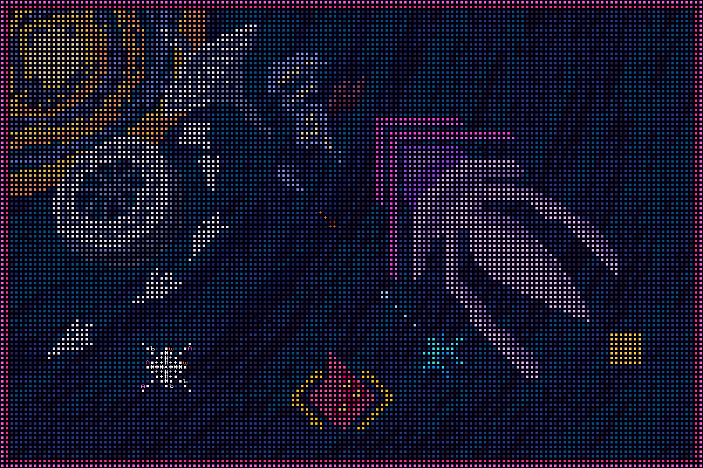

# Rogue Frontier

This repository is the home of all projects related to the  _Rogue Frontier_ universe, including *Rogue Atomics*
- ExtGodot, ExtSadConsole: compatibility layer for Godot and SFML exports
- GdFrontier, GdAtomics: Godot export for Rogue Frontier / Rogue Atomics
- LibAtomics: game code for Rogue Atomics
- LibFrontier: game code for Rogue Frontier
- LibGamer: shared code for LibFrontier, LibAtomics
- SfmlASECII: Sprite editor
- SfmlFrontier, SfmlAtomics: SFML export for Rogue Frontier / Rogue Atomics
- WebFrontier: Web export for Rogue Frontier

_Rogue Frontier_ is an ambitious ASCII-style space adventure set in an alternate timeline of *Transcendence* (and its predecessor, *Frontier*) - a space-opera roguelike by George Moromisato. The player receives an invitation from a deity known as The Orator to travel towards the Galactic Core. 

There are three main themes in the design of Rogue Frontier:
- Persistence: Factions engage in dynamic warfare. Systems update even while the player is in another system. Enemies can pursue the player across stargates.
- Mortality: All resources are limited. Armor degrades over time. Weapons run out of ammo. Reactors run out of fuel.
- Aesthetic: The world is painted with colored, extended ASCII tiles in order to push the limits of art.

This game is in early development and set to release at least prior to the heat death of the universe.

_Transcendence_ is property of Kronosaur Productions. _Rogue Frontier_ is an independent fangame.

## Play
Download and extract the ZIP archive. Run RogueFrontier.exe to play.

## Build
- Visual Studio 2022
- NET 9.0
- SadConsole (with SFML host)
